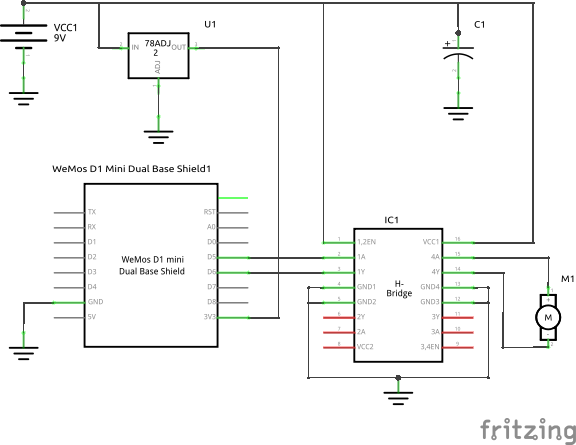
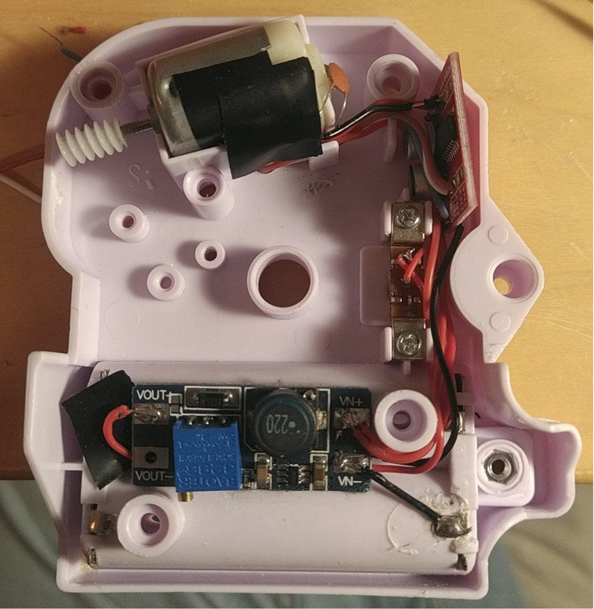

# LoopingLouieAdvanced

Hardware Mod for Looping Louie (by Hasbro Games)

Features:
- Higher voltage allows faster rotating for more fun!
- Also slower and even counterclockwise rotaion by an H-Bridge.
- Software on ESP32 chooses a random mode in periodic intervals ( random speed, counterclockwise or stop)  

# Hardware
- ESP32
- H-Bride
- Boost-converter (alternative: 9V block battery)
- 3V linear regulator (ESP supply voltage)
## Wiring
  

Or with the alternative stepup converter:  

# Software
A state mashine controls the pwm value. The defaut state is the HOLD_SPEED state. Configurable probabilities control the next state:
- HOLD_SPEED
- NEW_SPEED
- REVERSE_DIRECTION
- HOLD_REVERSE

Additional BREAK and ACCELERATE states keep the current consumption within a controlled level at which the dropping battery voltage does not cause a brown out of the ESP.
